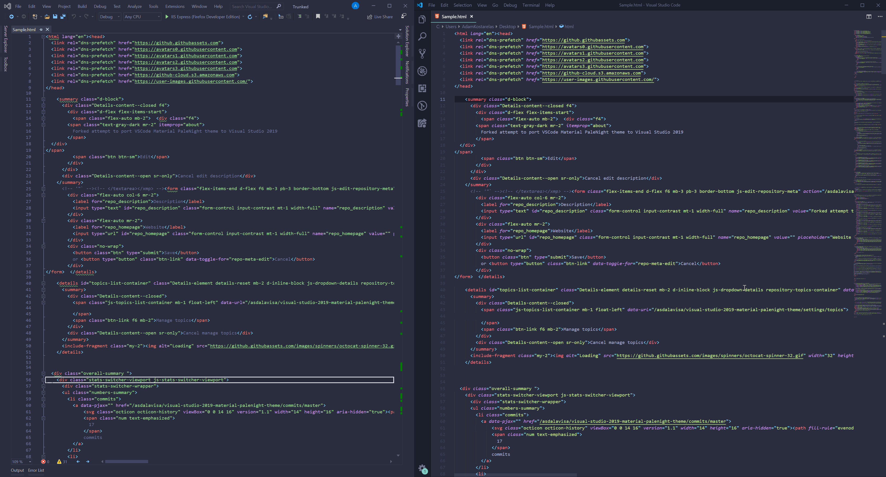

# Visual Studio 2019 Material Palenight theme
Port of Material VSCode PaleNight theme for Visual Studio 2019

Example below shows Visual Studio 2019 on left, with VS Code on Right

## Installation

- Install the ["Color Theme Editor for Visual Studio"](https://marketplace.visualstudio.com/items?itemName=VisualStudioPlatformTeam.VisualStudio2019ColorThemeEditor) extension
- Import the .pkgdef theme file
- Double click on the imported "Palenight" theme to enable it

That's it !

## Acknowledgement 
- Forked from https://github.com/gjactat/visual-studio-2017-palenight-theme which is originally based on the below:
- https://marketplace.visualstudio.com/items?itemName=whizkydee.material-palenight-theme
- https://studiostyl.es/schemes/material-theme-pale-night (editor colors)
Based on :
- https://github.com/equinusocio/vsc-material-theme Palenight High Contrast edition.
